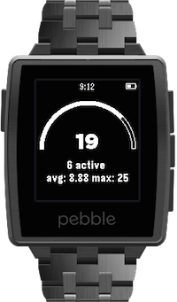
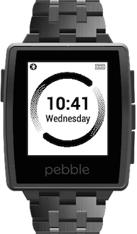
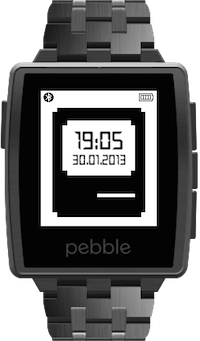
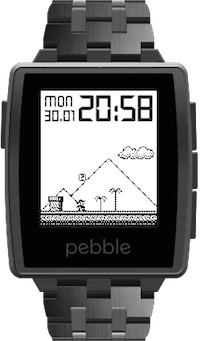
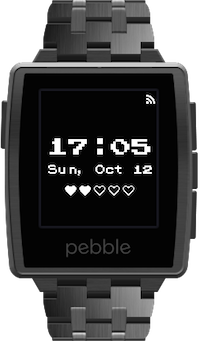

## GoSquared for Pebble

    

[GoSquared for Pebble project page](/projects/gosquared-for-pebble/)

## Relay FM

    
    

Created for [Myke Hurley](http://relay.fm).

- [Black](/downloads/pebble/RelayFMDigital.pbw)
- [White](/downloads/pebble/RelayFMDigitalWhite.pbw)

## 512 Watch Faces

    
    

Created for [Stephen Hackett](http://512pixels.net).

- [Black](/downloads/pebble/512pixelsblack.pbw)
- [White](/downloads/pebble/512pixels.pbw)

## Super Mario v2

    

I wanted a Pebble SDKv2 version of [this](http://www.mypebblefaces.com/apps/12151/7828/), so I made one.

- [Download](/downloads/pebble/SuperMario.pbw)

## Retro Time 24hr

    

Modified version of [Retro-Time](https://github.com/jonwgeorge/Retro-Time); different font, battery meter centered and changed to 20% sections.

- [Download](/downloads/pebble/RetroTime24hr.pbw)
